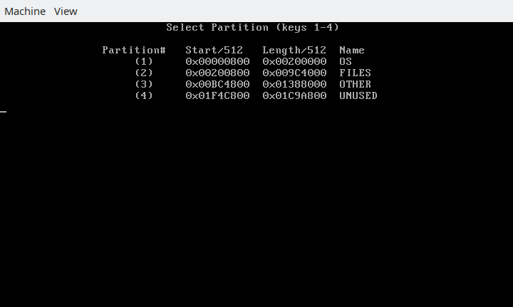

# MBR Bootloaders

A pair of bootloaders for easy chainloading from a FAT32 partition on a MBR drive



## About/Features

This repository contains two bootloaders I developed for easily testing a small hobby OS. Together, they chainload and jump to a flat binary file called `Boot/FAT32MBR` located on a selected FAT32 partition.  Once the bootloaders are burned to the disk, the `Boot/FAT32MBR` can be changed from the regular file system without having to reconfigure the bootloaders.

The first bootloader presents a screen like the one shown above that presents the use the option of which partition to boot from. Based on the key pressed (`1, 2, 3, or 4` are allowed), it loads the first sector of that partition to address `0x7C00` and hands off execution. Therefore, this can be used as a generic chainloader for any MBR formatted drive.

The second bootloader is for installation in the first sector of a FAT32 partition, and this is the one that searches for the file `Boot/FAT32MBR` and jumps to it. If no such file exists, it displays `ERROR`.

If you are trying to make a serious OS, you should probably switch to a more established bootloader (probably GRUB), but for starting out, this makes it really easy to test your OS on physical hardware; you can make the partitions on a USB, burn these bootloaders, and copy other files over normally.

Note: Due to current limitations, the maximum allowed size for Boot/FAT32MBR is 4096 bytes

## Building the bootloaders:

To assemble the files, run:
```
make build-all
```
(Note: This requires `nasm` installed)

If you want to change which file/directory you want to load from, go to `Source/FAT32-Bootloader.asm` and change the strings after `bootDirectoryFileName` and `bootFileFileName`. These must be 8.3 file names, so they must be in all caps and contain spaces padding their length to 11 characters.

## Burning to Disk:

### WARNING!!!:
The following scripts use the `dd` command to directly write to directly to drives. IT IS CRITICAL THAT YOU TYPE THE CORRECT DRIVE NAME! Failure to do so could make your normal hard drive unbootable. Use `fdisk -l` to see what the drive names are before doing anything.

### MBR Bootloader

To burn the Master Boot Record bootloader, run (with `sudo` permission probably):
```
make burn-mbr-bootloader drive={drive path}
```
Here, `drive path` will be probably be `/dev/sd{letter}`; (It should be an entire drive, NOT a partition); check `fdisk -l` to be sure

### FAT32 Bootloader

To burn the Master Boot Record bootloader, run (with `sudo` permission probably):
```
make burn-fat32-bootloader drive={drive path}
```
Here, `drive path` will be probably be `/dev/sd{letter}{number}` (It should be a partition, NOT an entire drive); check `fdisk -l` to be sure

